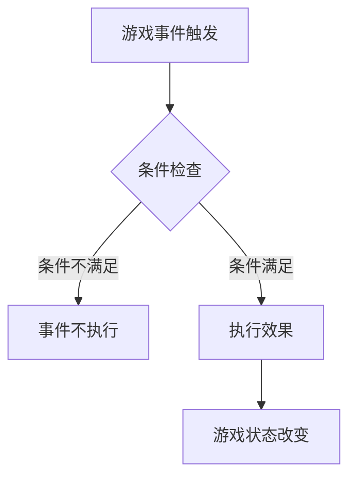
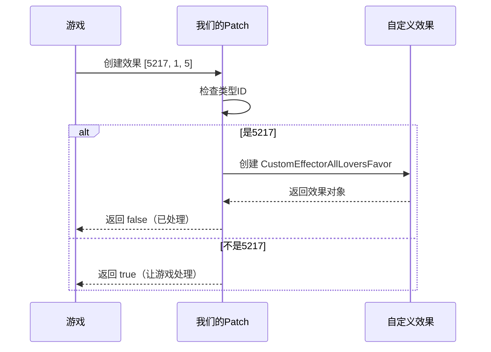
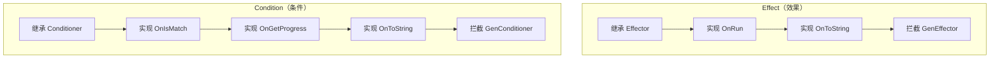

# 《学生时代》游戏 Effect & Condition 系统开发教程

---

## 一、什么是 Effect 和 Condition？

### 1.1 通俗理解



| 概念 | 生活中的例子 | 游戏中的作用 |
|------|-------------|-------------|
| **Condition（条件）** | 进门需要钥匙 | 检查玩家是否满足某个条件 |
| **Effect（效果）** | 开门后进入房间 | 改变游戏里的某些数值 |

### 1.2 具体例子

**场景：约会事件**

```
条件：玩家必须有恋人
效果：恋人好感度 +10
```

在游戏配置中写成：
```json
{
    "condition": [[52, 1, 1]],      // 检查是否有恋人
    "effect": [[1, 1, 9009, 10]]    // 好感度+10
}
```

---

## 二、如何添加新的效果（Effect）

### 2.1 整体流程


### 2.2 Step 1：设计你的效果

**先想清楚这3个问题：**

1. **效果ID**：用一个数字代表这个效果（建议用 5000 以上的数字，避免和游戏冲突）

2. **参数格式**：需要什么参数？
   ```
   例如：给其他恋人增加好感度
   格式：[5217, 子类型, 数值]
   示例：[5217, 1, 5] 表示给其他恋人+5好感
   ```

3. **作用对象**：影响谁？

**总结举例：**

1.**设计效果**：你和某个恋人互动后，其他恋人好感发生变化x（都给我吃醋！！）

2.**格式**：[5217, 1, x]

### 2.3 Step 2：编写效果代码

**创建文件：`Effects/CustomEffectorAllLoversFavor.cs`**（随便好记命名.cs）

```csharp
// 引用
using Effect;
using Sdk;
using System.Collections.Generic;

//命名空间，避免与其他模块重名
namespace LinceMultipleLovers 
{
    /// <summary>
    /// 自定义效果：给其他恋人增加好感度
    /// 配置格式：[5217, 1, X]  X为变化值（正数增加，负数减少）
    /// </summary>
    public class CustomEffectorAllLoversFavor : Effector // 继承游戏Effector
    {
        // 保存1和x参数
        private int subType;
        private float value;

        // 构造函数1：序列化必须无参构造函数
        public CustomEffectorAllLoversFavor() { }

        // 构造函数2：解析配置参数（1，x）
        public CustomEffectorAllLoversFavor(Effector _effector, List<float> _effect)
            : base(_effector, _effect)
        {
            // _effect 就是配置里的数组 [5217, 1, 5]
            this.subType = (int)_effect[1];  // 取第2个元素：1
            this.value = _effect[2];          // 取第3个元素：5
        }

        // 核心方法：执行效果
        public override void OnRun(float _rate = 1f, bool _toast = false)
        {
            // 获取所有恋人（我在别处已经定义了）
            var allLoverIds = LoverIdInterceptor.GetAllLoverIds();
            int currentLoverId = Singleton<RoleMgr>.Ins.GetLoveData().loverId;
            
            // 计算实际变化值（考虑倍率）
            float favorChange = this.value * _rate;

            // 遍历所有恋人，修改好感度
            foreach (int loverId in allLoverIds)
            {
                // 跳过当前正在约会的恋人
                if (loverId == currentLoverId) continue;

                // 增加好感度
                Singleton<RoleMgr>.Ins.AddRoleFavor(loverId, favorChange);
            }
        }

        // 显示文本：在游戏里显示什么文字
        public override string OnToString(float _rate = 1f, int _type = 0)
        {
            float displayValue = this.value * _rate;
            string sign = displayValue >= 0 ? "+" : "";
            return $"其他恋人好感{sign}{displayValue:0.#}";
        }
    }
}
```

### 2.4 Step 3：让游戏认识你的效果

**创建文件：`Patches/CustomEffectPatch.cs`**（同上，利用HarmonyLib拦截）

```csharp
// 引用
using HarmonyLib;
using Effect;
using System.Collections.Generic;

namespace LinceMultipleLovers.Patches
{
    /// <summary>
    /// 拦截游戏的效果创建，注入我们的自定义效果
    /// </summary>
    [HarmonyPatch(typeof(CommonEvtMgr), nameof(CommonEvtMgr.GenEffector))]
    public static class CustomEffectPatch
    {
        [HarmonyPrefix]
        public static bool Prefix(List<float> _effect, ref Effector __result)
        {
            // 检查参数
            if (_effect == null || _effect.Count < 3)
                return true;  // 参数不对，让游戏自己处理（避免影响原版游戏效果）

            // 检查是不是我们的效果类型（5217）
            int type = (int)_effect[0];
            if (type != 5217)
                return true;  // 不是我们的效果，让游戏自己处理（避免影响原版游戏效果）

            try
            {
                // 创建我们的效果对象
                __result = new CustomEffectorAllLoversFavor(null, _effect);
                
                // 返回 false 告诉游戏对于5217就别管了，由我们的代码来处理
                return false;
            }
            catch
            {
                // 出错了，让游戏自己处理（会显示"无此效果"错误）
                return true;
            }
        }
    }
}
```

**拦截原理流程图：**（看不懂算了）



### 2.5 Step 4：在配置文件中使用

在任意 JSON 配置文件中添加：

> 当然如果你安装了最新版v1.3.2的话，我自己为了方便测试还给游戏内置控制台新增了一个命令LINCE EFFECT <effect参数>来直接触发效果，不用再去用mod加载配置。

```json
{
    "id": 99999,
    "name": "测试效果",
    "effect": [
        [5217, 1, 5]      // 给其他恋人+5好感度
    ]
}
```

---

## 三、如何添加新的条件（Condition）

### 3.1 整体流程


### 3.2 Step 1：设计你的条件

**想清楚这3个问题：**

1. **条件ID**：用一个数字代表（建议 5000 以上）
2. **判断逻辑**：什么情况下返回 true？
   ```
   例如：检查恋人数量是否达标
   格式：[5207, 子类型, 目标数量]
   示例：[5207, 1, 2] 表示检查是否>=2个恋人
   ```
3. **进度显示**：如何显示进度条？

### 3.3 Step 2：编写条件代码

**创建文件：`Conditions/CustomConditionerLoverCount.cs`**

```csharp
using Condition;
using Sdk;
using System;
using System.Collections.Generic;

namespace LinceMultipleLovers
{
    /// <summary>
    /// 自定义条件：检查恋人数量
    /// 配置格式：[5207, 子类型, 目标数量]
    ///   子类型=1：检查是否 >= 目标数量
    ///   子类型=-1：检查是否 <= 目标数量
    /// </summary>
    public class CustomConditionerLoverCount : Conditioner
    {
        // 保存目标数量
        private int threshold;

        // 构造函数1：必须有无参构造函数
        public CustomConditionerLoverCount() { }

        // 构造函数2：解析配置参数
        public CustomConditionerLoverCount(Conditioner _conditioner, List<double> _condition)
            : base(_conditioner, _condition)
        {
            // _condition 就是配置里的数组 [5207, 1, 2]
            // base 已经帮我们取了 subType = (int)_condition[1]
            this.threshold = (int)_condition[2];  // 取第3个元素：2
        }

        // 核心方法：判断是否满足条件
        public override bool OnIsMatch()
        {
            // 获取当前恋人数量
            int loverCount = LoverIdInterceptor.GetAllLoverIds().Count;

            // 根据子类型判断
            if (this.subType == 1)
                return loverCount >= this.threshold;   // 大于等于
            else if (this.subType == -1)
                return loverCount <= this.threshold;   // 小于等于
            
            return false;  // 未知子类型，默认不满足
        }

        // 进度显示：返回 (当前值, 目标值)
        public override ValueTuple<float, float> OnGetProgress()
        {
            int loverCount = LoverIdInterceptor.GetAllLoverIds().Count;
            return new ValueTuple<float, float>(loverCount, this.threshold);
        }

        // 显示文本：在游戏里显示什么文字
        public override string OnToString(int _type = 0)
        {
            if (this.subType == 1)
                return $"恋人数量≥{this.threshold}";
            else if (this.subType == -1)
                return $"恋人数量≤{this.threshold}";
            return $"恋人数量条件";
        }
    }
}
```

### 3.4 Step 3：让游戏认识你的条件

**创建文件：`Patches/CustomConditionPatch.cs`**

```csharp
using HarmonyLib;
using Condition;
using System.Collections.Generic;

namespace LinceMultipleLovers.Patches
{
    /// <summary>
    /// 拦截游戏的条件创建，注入我们的自定义条件
    /// </summary>
    [HarmonyPatch(typeof(CommonEvtMgr), nameof(CommonEvtMgr.GenConditioner))]
    public static class CustomConditionPatch
    {
        [HarmonyPrefix]
        public static bool Prefix(List<double> _condition, ref Conditioner __result)
        {
            // 检查参数
            if (_condition == null || _condition.Count < 3)
                return true;

            // 检查是不是我们的条件类型（5207）
            int type = (int)_condition[0];
            if (type != 5207)
                return true;  // 不是我们的条件，让游戏处理

            try
            {
                // 创建我们的条件对象
                __result = new CustomConditionerLoverCount(null, _condition);
                
                // 返回 false 告诉游戏别管了，让我的代码来处理
                return false;
            }
            catch
            {
                // 出错了，让游戏自己处理
                return true;
            }
        }
    }
}
```

### 3.5 Step 4：在配置文件中使用

在任意 JSON 配置文件中添加：

```json
{
    "id": 301,
    "name": "多人约会",
    "unlock": [
        [5207, 1, 2]      // 解锁条件：至少有2个恋人
    ]
}
```

---

## 四、Effect vs Condition 对比



| 对比项 | Effect | Condition |
|--------|--------|-----------|
| 继承类 | `Effector` | `Conditioner` |
| 核心方法 | `OnRun()` | `OnIsMatch()` |
| 返回值 | 无（直接修改游戏） | `bool`（true/false） |
| 额外方法 | `OnToString()` | `OnGetProgress()` + `OnToString()` |
| 拦截目标 | `GenEffector` | `GenConditioner` |
| 配置字段 | `effect` | `condition` / `unlock` |

---

## 五、调试方法：查看日志

日志文件位置：`BepInEx/LogOutput.log`

开启调试模式后，可以在日志中查看自定义效果和条件的执行情况。

---

## 六、完整文件清单

添加一个新的 Effect 需要 **2个文件**：

```
项目目录/
├── Effects/
│   └── CustomEffectorXXX.cs      # 效果实现
└── Patches/
    └── CustomEffectPatch.cs      # 拦截补丁
```

添加一个新的 Condition 需要 **2个文件**：

```
项目目录/
├── Conditions/
│   └── CustomConditionerXXX.cs   # 条件实现
└── Patches/
    └── CustomConditionPatch.cs   # 拦截补丁
```

---

## 七、常见问题

### Q1：类型ID怎么选？

```
推荐范围：5000 - 9999

原因：
• 1-100：游戏原版使用
• 101-4999：可能与其他Mod冲突
• 5000+：安全的自定义区域
```

### Q2：为什么返回 false？

```csharp
return false;  // 告诉游戏："我处理完了，你别管了"
return true;   // 告诉游戏："我不会处理，你来吧"
```

### Q3：如何获取游戏数据？

```csharp
// 获取当前存档
var roleMgr = Singleton<RoleMgr>.Ins;

// 获取恋爱数据
var loveData = roleMgr.GetLoveData();
int currentLoverId = loveData.loverId;

// 获取所有恋人
var loverIds = LoverIdInterceptor.GetAllLoverIds();

// 获取指定NPC
var npc = roleMgr.GetRole(npcId);
string npcName = npc.Name;
```

---

## 八、快速模板

### Effect 模板

```csharp
using Effect;
using Sdk;
using System.Collections.Generic;

namespace LinceXXX
{
    public class CustomEffectorXXX : Effector
    {
        private int subType;
        private float value;

        public CustomEffectorXXX() { }

        public CustomEffectorXXX(Effector _effector, List<float> _effect)
            : base(_effector, _effect)
        {
            this.subType = (int)_effect[1];
            this.value = _effect[2];
        }

        public override void OnRun(float _rate = 1f, bool _toast = false)
        {
            // 在这里写效果逻辑
        }

        public override string OnToString(float _rate = 1f, int _type = 0)
        {
            return "效果描述";
        }
    }
}
```

### Condition 模板

```csharp
using Condition;
using Sdk;
using System;
using System.Collections.Generic;

namespace LinceXXX
{
    public class CustomConditionerXXX : Conditioner
    {
        private int threshold;

        public CustomConditionerXXX() { }

        public CustomConditionerXXX(Conditioner _conditioner, List<double> _condition)
            : base(_conditioner, _condition)
        {
            this.threshold = (int)_condition[2];
        }

        public override bool OnIsMatch()
        {
            // 返回 true 或 false
            return true;
        }

        public override ValueTuple<float, float> OnGetProgress()
        {
            return new ValueTuple<float, float>(0, this.threshold);
        }

        public override string OnToString(int _type = 0)
        {
            return "条件描述";
        }
    }
}
```

